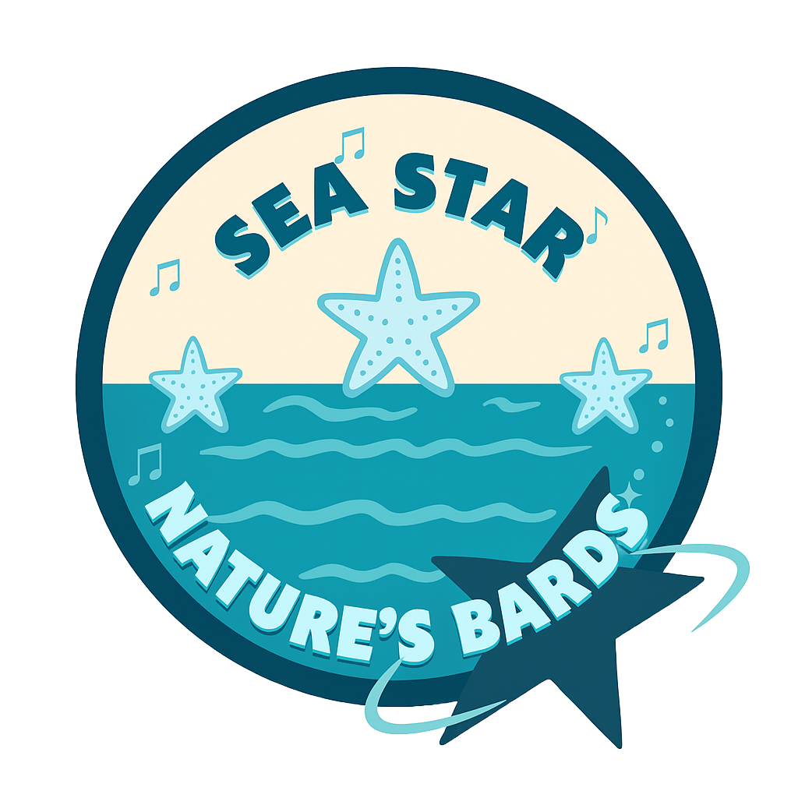

August 2025
# Nature's BARDS 🧬

## Overview 💭
This project blends **bioinformatics** and **music**, using sonification techniqus to analyze and design nanobody sequences.  

### Goals 🎯
1. Learn about nanobodies and their sequences.
2. Explore existing databases such as **SabDab** and **Echinobase** to extract protein sequences.
3. Translate amino acid sequences into musical notes.
4. Analyze musical patterns to potentially design proteins.

### Outcomes 🎉
1. Translated amino acid sequences into musical notes

### Team Members 👥

| Name              | Role                                     |
|-------------------|------------------------------------------|
| Fatima Ali        | Writer, SabDab Nano Curator              |
| Samantha Barrera  | Logo & Slides Designer                   |
| Rojina Magar      | Code, Technical Writer                   |
| Jacob Sagrans     | Code, Technical Writer, Music Liaison    |
| Afsheen Rahman    | SabDab Nano Curator, Echinobase Explorer |
| Ei Kay Khaing Myo | Code, Echinobase Explorer                |                                           
| Thomas Onorato    | Leader                                   |

## Tools & Software 🛠️
  - Colab Notebook / Jypter Notebook
  - Python for sequence to sound mapping
  - MIDI/WAV file export
  - MuseScore (music notation)
  - SabDab (Structural Antibody Database)
  - Echinobase (Marine Proteins)
    

## User Guide 📝

1. **Run the notebook**  
   Open the provided `.ipynb` file in Jupyter Notebook or Google Colab. 
   Execute the cells to convert nanobody amino acid sequences into MIDI files.

3. **Output files**  
   The program generates:  
   - `.mid` (MIDI) files — digital music files playable by most media players  

4. **Editing and playback**  
   Use free software like [MuseScore](https://musescore.org/en) to:  
   - Open and edit the MIDI files  
   - Play back the sonified sequences for auditory analysis  
   - Export audio or sheet music as needed

---

*Feel free to modify the notebook and mapping rules to explore different sonification schemes!*

## Future Ideas 💡
- Modify the code to accept **user input sequences** dynamically, so users don't have to edit the code for every run.  
- Add features to export additional audio formats (e.g., WAV).  
- Integrate pattern recognition tools to automate motif discovery from sonified data.  

## Citations 📚
Buehler, M. J. (2023). Unsupervised cross-domain translation via deep learning and adversarial attention neural networks and application to music-inspired protein designs. Patterns, 4(3). https://doi.org/10.1016/j.patter.2023.100692 

Echinobase. (n.d.). Echinobase. https://www.echinobase.org/echinobase/

Hacisuleyman, A., & Erman, B. ModiBodies: A computational method for modifying nanobodies in nanobody-antigen complexes to improve binding affinity and specificity. J Biol Phys 46, 189–208 (2020). https://doi.org/10.1007/s10867-020-09548-3

MuseScore. (n.d.). MuseScore (music notation software). https://musescore.org/en

SAbDab. (n.d.) SAbDab: The Structural Antibody Database. https://opig.stats.ox.ac.uk/webapps/sabdab-sabpred/sabdab

Yu, C.-H., Qin, Z., Martin-Martinez, F. J., & Buehler, M. J. (2019). A self-consistent sonification method to translate amino acid sequences into  musical compositions and application in protein design using artificial intelligence. ACS Nano, 13(7), 7471-7482. https://www.doi.org/10.1021/acsnano.9b02180.
###

